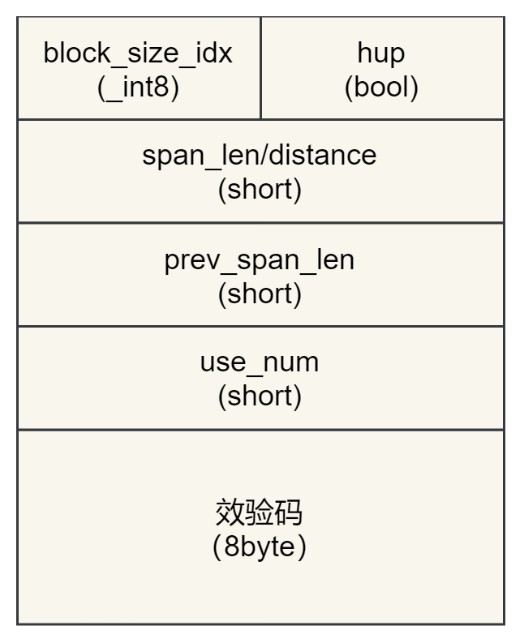
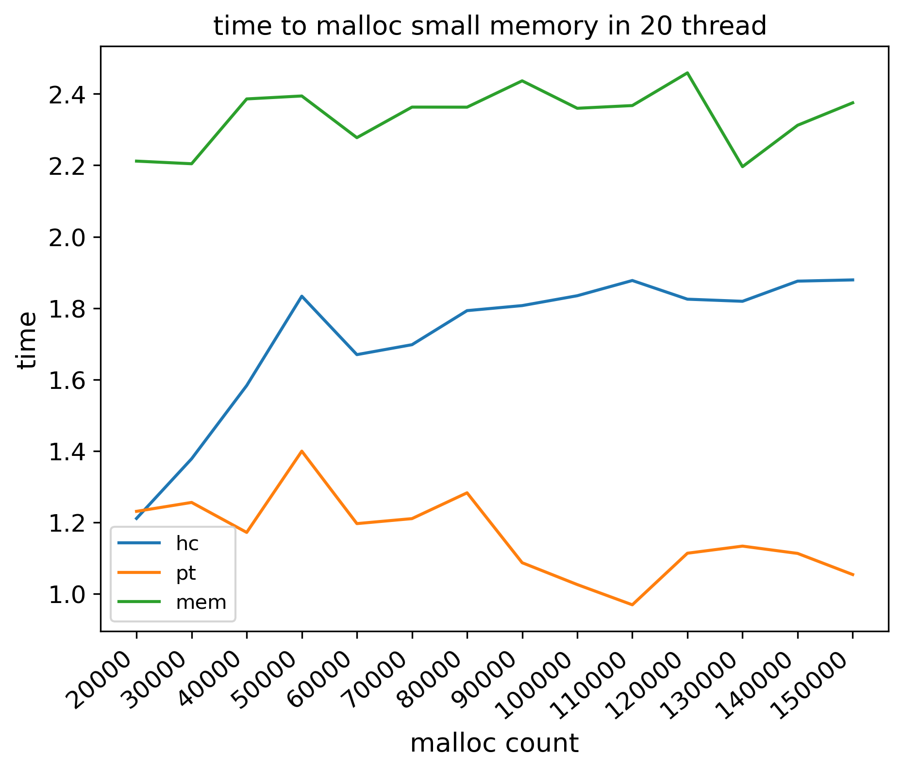
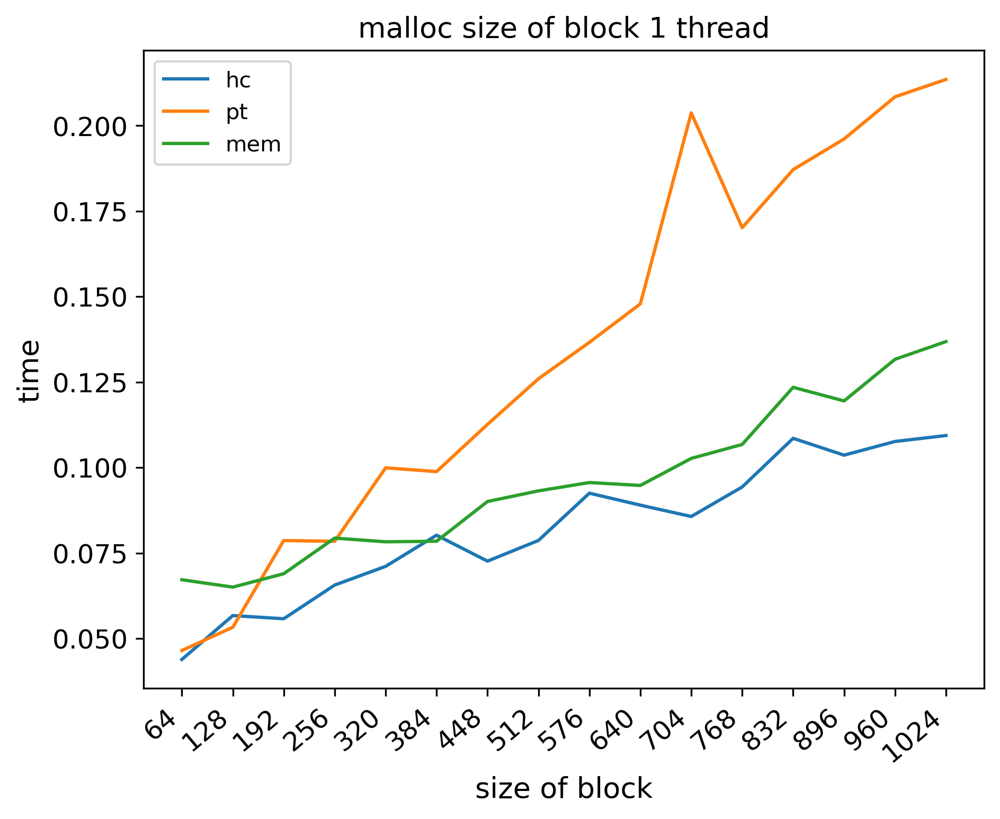

# hcmalloc技术文档

赛题选择：[proj28-3RMM](https://github.com/oscomp/proj28-3RMM)

队伍名称：勇敢冲就队

队员姓名：黄棋彬，朱家明，谭忻

指导教师：李超

学校名称：广州大学

## 一 赛题介绍

### 【项目描述】

在工业控制、航天航空等严苛的应用环境中，计算机硬件通常会受到高低温、潮湿、电磁辐射、宇宙射线等恶劣因素的影响。为了实现高可靠的计算机系统，传统上多采用硬件的升级改造，或者定制操作系统/内核，其成本异常昂贵。

内存在计算机系统中的重要性仅次于CPU，在恶劣环境下会出现单粒子翻转等问题，进而导致程序或系统崩溃。如果能通过软件的解决方案，实现一个针对严苛场景下的内存管理器，有助于节省硬件成本。

3RMM项目的目标是，实现一个可靠的、健壮的、实时的内存管理器，在Linux系统下以一个库的形式对外发布，运行在用户态。建议使用C语言开发，以便将来更易于移植到Linux内核或别的操作系统中。

- Reliable 可靠  
     实现基本的内存管理功能，包括内存池等，在重负载、高并发、长期运行的情况，系统都能正常使用。

- Robust 健壮  
     在内存出现单粒子翻转等异常情况下，依然能够正常运行。

- Real-time 实时  
     使用高效的内存分配算法以及其他技术手段，加快内存分配和读写的速度。

### 【预期目标】

##### 第一题：简单的内存分配器

- 实现一个内存分配器（allocator），并具备基本的功能;
- 支持的接口至少包括malloc、calloc、realloc、free;
- 具体实现可参考glibc/Ptmalloc2、[_mimalloc_](https://github.com/microsoft/mimalloc) 、[_tcmalloc_](https://github.com/gperftools/gperftools)、[_jemalloc_](https://github.com/jemalloc/jemalloc)。

##### 第二题：支持多线程的高效内存分配器

- 在第一题的基础上，支持多线程和并发 （利用锁机制保护相关操作的临界区）;
- 通过benchmark测试，benchmark的参考实现为[_mimalloc-bench_](https://github.com/daanx/mimalloc-bench);
- 根据benchmark测试的性能数据，以及测试中占用的物理内存，综合评估方案，目标平台x86_64。

##### 第三题：支持内存池的内存分配器

- 内存池是一个块预分配的内存区域，基于内存池的内存分配和释放都在内存池中完成;
- 支持基于处理器核心亲和度的内存池管理（以提高访存性能）;
- 支持的接口至少包括pool_create、pool_clear、pool_destroy、palloc、pcalloc;
- 参考实现为[_apr_pool_](https://github.com/apache/apr)，以及Linux的NUMA机制。

##### 第四题：高可靠的内存管理器

- 在第一题的基础上，实现一个高可靠的内存管理器;
- 可以采用校验、备份、三模冗余、纠删码等各种方式，实现抗单粒子翻转的功能;
- 已分配内存的1个bit值出现错误的情况，依然能够读取正确的值;
- 对有异常的内存，能够自动修复;
- 上述处理层的加入，内存无法直接读取，需要内存的读写接口，实现内存在读写中数据的自动冗余备份、校验和纠错写;
- 本题测试方法：程序运行过程中，外部检测框架修改特定内存来模拟异常，程序内存不会出现读写错误。

##### 第五题：3R的内存管理器

- 在第四题的基础上，进一步提高性能和实时性，兼顾3R (Reliable 可靠，Robust 健壮，Real-time 实时）;
- 使用benchmark进行测试，根据性能数据以及测试中占用的物理内存综合评估方案，目标平台为x86_64。


## 二 比赛调研

​	赛题要求我们设计一个可靠，健壮，实时的内存分配器，并且实现抗单粒子翻转等功能。

​	我们在前期做了一些学习，参考了不同的内存分配器。

学习了以下内容

- 学习ptmalloc，简略阅读GLIBC2.27源码，参考pt[相关博客](https://ctf-wiki.org/pwn/linux/user-mode/heap/ptmalloc2/heap-overview/)
- 找tcmalloc的相关博客，了解tcmalloc的设计思路
- 简单了解jemalloc多线程设计
- 阅读上届比赛优秀代码
- 寻找抗单粒子翻转的算法，参考了专利 [CN101281481A](https://patents.google.com/patent/CN101281481A/ar)（一种存储器抗单粒子翻转的纠错检错方法）

## 三 架构设计

### 整体架构

下图为内存分配器整体架构


架构说明：

​	1.内存分配器分为两层缓存，第一层中央内存池向系统申请内存，切割为多个4MB大小的book。第二层线程缓存与线程一一对应，从中央内存池获取book，切割为span或者block返回给用户。

​	2.内存分配器将用户的内存分配释放大小分为三个层次。

- 小于256K为小内存分配，参考tcmalloc，将不同的申请对齐到86种大小，对应86种切割策略，线程缓存在拥有的book中切割出多个block，将其链入线程缓存的block_bin中，以备后面快速分配。
- 大于256K且小于1MB为大内存分配，大内存分配大小对齐8K，在线程缓存中切割出一个对应大小的span返回给用户。
- 大于1MB为超大内存分配。超大内存分配直接使用系统调用mmap()。

### 数据结构设计

​	在hcmalloc中我们设置一个page为8K，多个page可以组成一个span，span可以被切割为多个block，也可以直接作为一整块内存被分配给用户。存储span，block大小等信息的头部header被分集中记录在一起。

#### book设计


​	每一个4MB的book包含512个page，多个page组成span。每个page都有16字节的头部，这些头部被集中在book的第一个page，我们称之为header page，header page刚好可以放下512个header，而header page本身不需要header记录，我们就将这16个字节用于book的连接。由于book大小为4MB，且与地址对齐，每一个page可以通过掩码和移位运算快速地在header和page中转换。在内存释放的时候，我们可以通过传入的指针快速找到当前传入指针对应的块大小，将header集中在一起也方便了span的合并。

#### header	

​	header的设计参考了pt，帮助我们快速地合并span，并检测span中的block个数。header记录了page的有关信息，其设计如下图



- block_size_idx：
     - 小于86时，为当前span切割出的block大小
     - 大于等于86时，当前span被直接分配给用户
- hup：
     - 低三个bit记录了三个信息，由高到低分别为
          - is_head：是否为span的第一个page，只有该位有效，这个header的记录才有效
          - inuse：当前span是否正在使用
          - prev_inuse：前一个span是否正在使用
- span_len：
     - 当is_head为真：当前span的大小
     - 当is_head为假：当前page与span第一个page的距离
- prev_span_len:
     - 上一个span的长度
- use_num：
     - 当前span被切割出去block的分配个数
- 校验码：
     - 八个字节，用于校验前面八个字节的数据


#### page

page的数据结构设计如下

```c
struct page_s
{
  page* next;
  page* prev;
  header page_header[511];
};
```

​	当page是header page时，next用于连接下一个book，prev用于校验next的信息。后面紧跟511个数据page的header。该page不是header page且空闲时，next和prev用于连接同级别大小的双向链表，非空闲时数据结构无效。

​	由于在各个book中数据page被header page隔开，因此span最长的长度为511，我们将1-511长度的span通过二的幂次分为9个级别，与线程缓存中的_span_bin双向链表连接在一起，并且使用从小到大排序。在寻找的过程中使用首次适应就是最小的合适span，再通过检测进行切割。


#### 申请流程

申请内存流程如下：


#### 释放流程

释放内存流程如下


## 四 抗单粒子反转

### LDPC算法

​	抗单粒子翻转使用LDPC前向纠错算法，这种算法只需要两倍的空间，解码能力接近香农极限。相比于三模冗余需要的内存更小。

​	我们参考了众多的抗单粒子翻转的方法，决定采用该[专利CN101281481A](https://patents.google.com/patent/CN101281481A/ar)（一种存储器抗单粒子翻转的纠错方法）来实现抗单粒子翻转，能够自动修复有异常的内存，并在读写操作中实现数据的自动冗余备份、校验和纠错写。借鉴实现的算法可以纠正一位或者两位的错误，并且检查出不可纠正的错误。纠错能力比三模冗余，奇偶效验更高。

​	我们在实现抗单粒子翻转的同时减少了内存的占用，此外，在发生两位数据错误时，我们也能成功纠错。

### 纠错流程


1. 从内存中接收K位信息数据，将其以8位为单位分组
2. 生成与所述K位信息数据每8位信息生成对应的8位校验数据A，采用P=M·G进行计算得到A，M是1x8行向量，G是一个8x8的生成矩阵
     1. 将信息数据和校验数据存入存储器
3. 在从存储器中读取信息数据，采用2中方法重新生成与信息数据对应的校验数据B
4. 将校验数据A和校验数据B进行异或运算，得到校正子
5. 通过校正子定位信息数据和检验数据A中的错误，若产生一位或两位数据错误，则纠正数据错误并返回正确的数据。将校正子奇偶校验矩阵H进行比较，如果校正子只有一列与奇偶校验矩阵H相同则可以判断信息数据或校验数据A中产生一位错误；若校正子与奇偶校验矩阵H中某两列的按位异或运算结果对应相同，则可判断信息数据或校验数据A中产生两位数据错误，奇偶校验矩阵H=（G转置 | 单位矩阵I）是一个8x16的矩阵。

​	我们使用一块内存来存放原始信息数据，再用一块同等大小的内存块来存放校验数据A，我们采用的这个方法比三模冗余更加**节省空间**，并且我们能够做到检测**一位和两位**发生错误的信息，并且能够成功纠错。

我们使用的方法也称为“量子重复码”技术，与三模冗余相比，我们的方法有以下优势：

1. 量子重复码可以将一个量子比特复制成多个副本，从而增强了对错误的抵御能力。与三模冗余中只复制成三个副本相比，量子重复码可以复制成更多的副本，从而提高了纠错能力。
2. 量子比特具有叠加态和纠缠态等经典比特所不具备的特性，可以实现更加复杂的纠错方案。例如，量子比特可以通过量子纠缠实现纠错，而这是经典比特所不能做到的。
3. 量子比特的状态可以通过量子非破坏测量（Quantum Non-Demolition，QND）进行检测，从而可以检测到单粒子翻转错误。而在经典比特中，单粒子翻转错误只能通过投票等方式进行检测，无法进行直接的检测。
     综上，我们的方法时基于量子比特的纠错方法，相比于三模冗余具有更加优越的性能，并且可以应用于更加复杂的系统中。

## 五 测试数据

exp1:对hcmalloc、memmalloc、ptmalloc进行测试，测试内容是单线程下，单次内存分配大小0x40，分配次数从1万到15万（间隔1万），得到的测试结果如下，我们的hcmalloc和ptmalloc的结果较为接近，而且测试结果都比较均匀，稳定，memmalloc分配起伏较大，效果最差。


exp2：对hcmalloc、memmalloc、ptmalloc进行测试，测试内容是在20个线程下，单次内存分配大小0x40，分配次数从1万到15万（间隔1万），得到的测试结果如下，在20个线程这种情况下，我们的hcmalloc和ptmalloc的结果更为接近，测试结果都不错，分配情况良好，而memmalloc在小内存的分配时间较慢，总体速度偏慢，分配时间差值大。




exp3：对hcmalloc、memmalloc、ptmalloc进行测试，测试内容是单线程单次分配随机大小字节（0到4096），分配次数从1万增至15万（间隔1万），得到测试结果如下，在这种情况下，总体上我们的hcmalloc分配时间最短，测试效果最好，其次是memmalloc，当memmalloc的测试结果差值依旧比较大，较不稳定。ptmalloc分配时间最慢，当总体上比memmalloc稳定。


exp4：对hcmalloc、memmalloc、ptmalloc进行测试，测试内容是20个线程单次分配随机大小字节（0到4096），分配次数从1万增至15万（间隔1万），得到测试结果如下，在这种情况下，我们的hcmalloc分配最稳定，时间更短，测试效果最好，其次是memmalloc，ptmalloc最不稳定，变化幅度大，效果最差。


exp5：对hcmalloc、memmalloc、ptmalloc进行测试，测试内容是单线程下，单次内存分配大小从64字节开始，之后每轮增加64字节，直至1024字节，每轮分配重复10万次，得到的测试结果如下，在这种情况下，我们的hcmalloc的分配性能更好，时间的最值相差最小，变化幅度稳定，其次是memmalloc，ptmalloc的效果最差，变化幅度较大。



exp6：对hcmalloc、memmalloc、ptmalloc进行测试，测试内容是20个线程下，单次内存分配大小从64字节开始，之后每轮增加64字节，直至1024字节，每轮分配重复10万次，得到的测试结果如下，在这种情况下，我们的hcmalloc和memmalloc的测试结果较接近，但是hcmalloc总体上更加平稳，ptmalloc的结果较差，测试结果最值相差大。


exp_7:对hcmalloc、memmalloc、ptmalloc进行测试，测试内容是100个线程下，单次内存分配大小为0x40，每分配次数从1万到15万（间隔1万），得到的测试结果如下，在这种情况下，ptmalloc的分配效果最好最稳定，hcmalloc和memmalloc效果差不多，其中hcmalloc的分配速度较memmalloc快，memmalloc较memmalloc稳定。


exp_8:对hcmalloc、memmalloc、ptmalloc进行测试，测试内容是100个线程下，单次内存分配为随机大小（0到1024），每分配次数从1万到15万（间隔1万），得到的测试结果如下，在这种情况下，ptmalloc效果最好，分配时间最短，hcmalloc和memmalloc较差。


## 六 总结

​	总结，hcmalloc在大部分测试中单线程与多线程的申请都优于ptmalloc和memmalloc。在100个线程下，hcmalloc的速度下降较为明显。

​	对于多线程，hcmalloc可以使用宏在编译选择自旋锁与互斥锁，自旋锁在线程较少时有较好的性能表现，互斥锁有更高的稳定性，在明确少量线程时可以使用自旋锁。线程缓存可以在线程退出时销毁，对于短周期线程，可以选择等待线程结束后调用自动释放。线程与线程缓存的一一对应也带来了多次不必要的book转移和切割，后续可以分配出多个分配区来进行优化，减少多线程之间存取book导致的并发，并且减少book太大导致低负载下的内存碎片问题。

​	在健壮性上，hcmalloc可以通过边界检查分配内存是否因为溢出等攻击修改到内存其它位置。抗单粒子翻转方面，LDPC纠错码相比三模冗余有更高的纠错能力，超过两位发生错误时，可以检测出不可纠正的错误。但是page的头部留有纠错空间暂时没有实现。并且后期会加上三模冗余的编译选择，在翻转较少的情况下提供更好的性能。

​	hcmalloc运行时的物理内存占用较高，初步分析是空闲span的连接指针分隔较远，导致分配过程中大范围地读写，后期会将span的指针尽量集中；而且book对于部分分配较少次数的线程来说太大，在随机状态下，block切割过多都造成了浪费。

